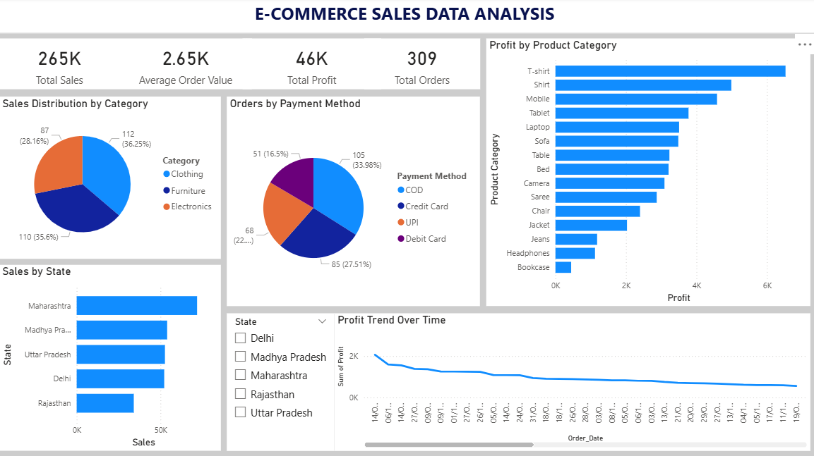

# 🛒 E-Commerce Sales Dashboard (Power BI)

## 📊 Project Overview

This project presents an interactive Power BI dashboard for analyzing e-commerce sales data. It helps in understanding business performance, customer behavior, and product trends.

## 🎯 Objective

* To analyze sales and profit data
* To identify top-performing categories and products
* To track monthly sales trends
* To provide insights for better decision-making

## 🛠️ Tools & Technologies Used

* Power BI
* Excel / CSV Dataset

## 📈 Key Features

* 📌 Total Sales & Profit Analysis
* 📌 Category-wise Performance
* 📌 Monthly Sales Trends
* 📌 Customer Insights

## 📷 Dashboard Preview

## 📁 Project Files

* ECOM_DATA1.pbix
* ecommerce_dataset_100_rows.csv
* dashboard1.png

## 🚀 Conclusion

This dashboard provides clear insights into e-commerce sales performance and helps businesses make data-driven decisions
